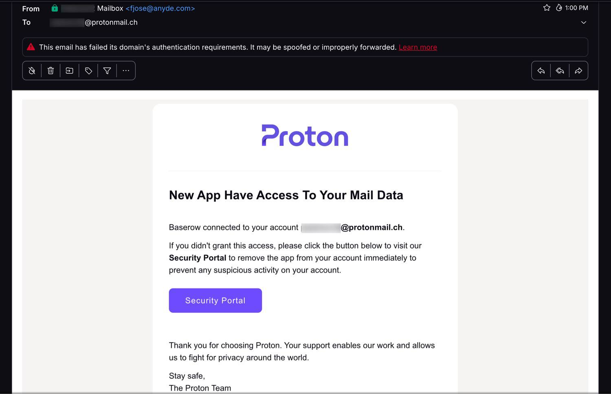
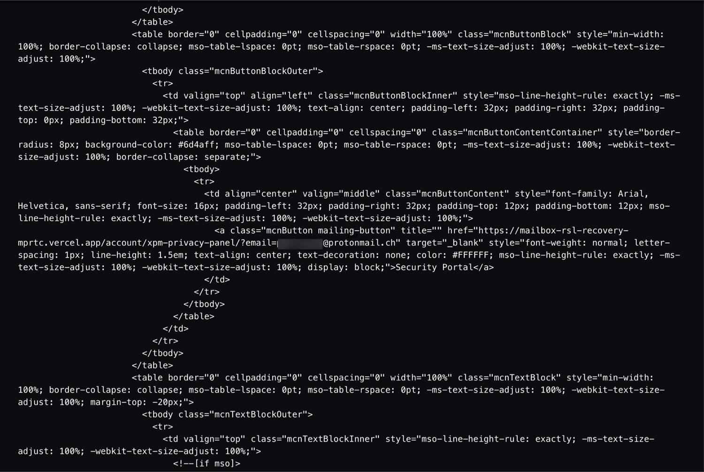
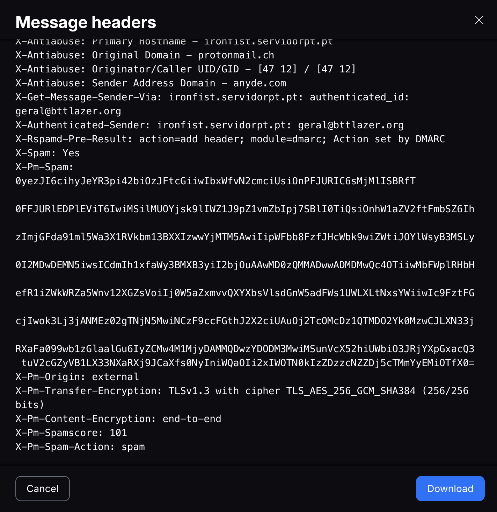
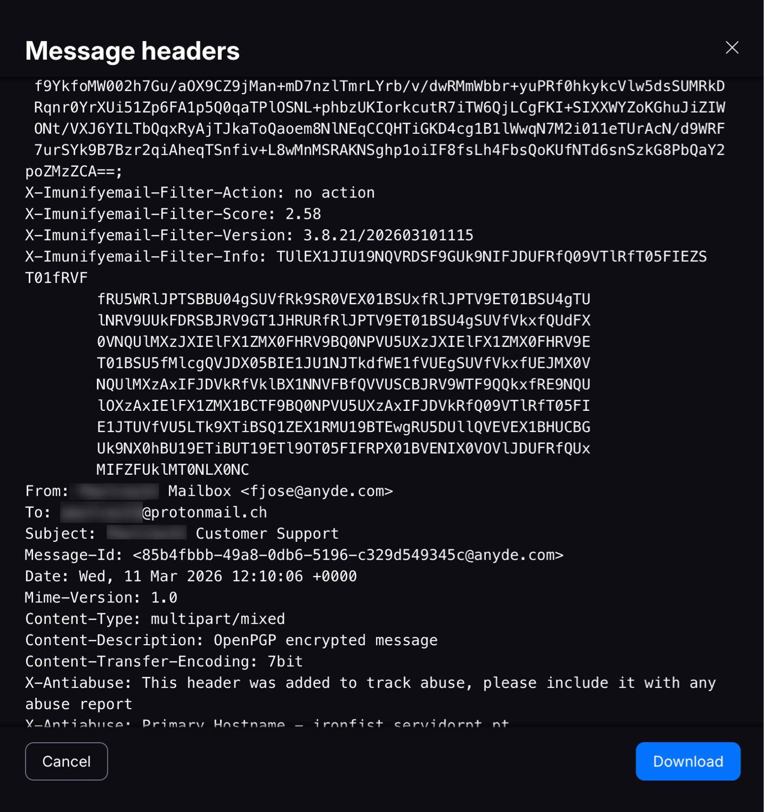

# Email Phishing Analysis — Proton Brand Impersonation

> In this write-up, I analyze a phishing email that impersonates **Proton**, with the goal of stealing the victim's credentials.

---

## 📚 Table of Contents

- [1. Context](#1-context)
- [2. Initial Observation](#2-initial-observation)
- [3. Email Content Analysis](#3-email-content-analysis)
- [4. Malicious Link Analysis](#4-malicious-link-analysis)
- [5. Email Header Analysis](#5-email-header-analysis)
- [6. SPF / DKIM / DMARC Explained](#6-spf--dkim--dmarc-explained)
- [7. Infrastructure Path](#7-infrastructure-path)
- [8. Indicators of Compromise (IOC)](#8-indicators-of-compromise-ioc)
- [9. SOC Verdict](#9-soc-verdict)
- [10. SOC Operational Response](#10-soc-operational-response)

---

## 1. Context

This analysis is based on a **suspicious email received in a Proton mailbox**.

The message claims:

> *"A new application has access to your mail data"*

The recipient is urged to click a button labelled:

```
Security Portal
```

However, Proton immediately displays an alert:

> **This email has failed its domain's authentication requirements.**

This means the **sender domain authentication is failing** — a clear red flag.

---

## 2. Initial Observation

When opening the email, several elements stand out right away.



### Visible warning signs

| Signal | Detail |
|--------|--------|
| Proton branding copied | Logo and layout mimicked |
| Fake security alert | "New app has access to your data" |
| Single action button | "Security Portal" — creates urgency |
| Proton authentication warning | Displayed at the top of the email |

> This is a classic phishing technique: **create a sense of urgency around account security** to push the victim to act without thinking.

---

## 3. Email Content Analysis

The email contains:
- The Proton logo
- A security warning message
- A "Security Portal" call-to-action button

**Subject line:**
```
New App Have Access To Your Mail Data
```

### Red Flags

#### ❌ Grammar error
The subject line is grammatically incorrect (*"Have"* instead of *"Has"*).  
Official emails from Proton are always reviewed before being sent.

#### ❌ No technical details
A real security email from Proton would include:
- Connection time
- Device name
- Location
- Name of the application involved

**None of these are present.**

#### ❌ Single call-to-action
The user is pushed to click immediately.  
This is a **typical phishing characteristic**.

---

## 4. Malicious Link Analysis

By inspecting the HTML source code of the button:



```html
<a href="https://mailbox-rsl-recovery-mprtc.vercel.app/account/xpm-privacy-panel/?email=...">
  Security Portal
</a>
```

The link points to:
```
vercel.app
```

> ⚠️ **Proton does not use this domain.** This is an external platform used to host fake pages.

### Security interpretation

The link most likely redirects to:
- A fake login page
- A phishing portal
- A credential harvesting site

This is a **critical phishing indicator**.

---

## 5. Email Header Analysis

Email headers allow us to identify the **true origin** of a message, regardless of what is displayed to the recipient.





Key fields:

```
From:        Mailbox <fjose@anyde.com>
Return-Path: <fjose@anyde.com>
```

The message **claims** to come from `anyde.com`.  
But the authentication checks tell a different story.

---

## 6. SPF / DKIM / DMARC Explained

These three protocols are used to verify the authenticity of an email sender.

### SPF (Sender Policy Framework)

**Result observed:**
```
spf=fail
```

SPF checks whether the server that sent the email is **authorized to send on behalf of the domain**.

> Here, the sending server is **not listed** in `anyde.com`'s SPF record. The domain did not authorize it.

---

### DMARC (Domain-based Message Authentication)

**Result observed:**
```
dmarc=fail
```

DMARC checks the **alignment** between the visible sender address and the actual authentication results.

> A DMARC failure means the sender identity is **likely spoofed**.

---

### DKIM (DomainKeys Identified Mail)

**Result observed:**
```
dkim=pass header.d=bttlazer.org
```

The message is **signed**, but by `bttlazer.org` — not by `anyde.com`.

> This means:
> - ✅ The email has a valid DKIM signature
> - ❌ But it is signed by **a domain controlled by the attacker**, not the legitimate sender

This is a subtle but important distinction — DKIM pass alone does **not** mean the email is legitimate.

---

## 7. Infrastructure Path

The `Received` headers show the **actual journey** of the email through servers.

```
Received: from [47.41.36.219] (helo=mail.bttlazer.org)
  by ironfist.servidorpt.pt
```

Then:

```
Received: from ironfist.servidorpt.pt
  by protonmail.ch
```

### Simplified flow

```
Attacker Host [47.41.36.219]
         ↓
   mail.bttlazer.org
         ↓
  ironfist.servidorpt.pt
         ↓
       Proton
```

> ⚠️ None of these servers belong to Proton's official infrastructure.

---

## 8. Indicators of Compromise (IOC)

### Domains
```
anyde.com
bttlazer.org
mail.bttlazer.org
ironfist.servidorpt.pt
mailbox-rsl-recovery-mprtc.vercel.app
```

### IP Addresses
```
47.41.36.219
185.32.188.7
```

### Authentication Results
```
SPF:   fail
DMARC: fail
DKIM:  pass (but signed by attacker-controlled domain bttlazer.org)
```

### Attack Techniques
```
Brand Impersonation
Credential Phishing
```

---

## 9. SOC Verdict

> 🔴 **This email is a phishing attempt using Proton brand impersonation.**

| Indicator | Finding |
|-----------|---------|
| Sender domain | `anyde.com` — not Proton |
| SPF | ❌ Fail |
| DMARC | ❌ Fail |
| DKIM | ⚠️ Pass, but signed by `bttlazer.org` (attacker domain) |
| Link destination | `vercel.app` — not Proton |
| Spam score | 101 (flagged as spam) |
| Proton alert | Authentication failure warning shown |

**Likely objective:**  
> Steal the victim's Proton credentials through a fake security login page.

---

## 10. SOC Operational Response

In an enterprise environment, here is how a SOC team would respond:

### 📥 Collection
- Save the raw email (`.eml` format)
- Export the full message headers

### 🔍 IOC Extraction
- Extract all domains, IPs, and URLs
- Submit IOCs to threat intelligence platforms (VirusTotal, AbuseIPDB, etc.)

### 🕵️ Threat Hunting
Search across the environment for:
- Other users who received the same email
- Clicks on the malicious link
- DNS queries to the identified domains

### 🚧 Containment
- Block domains at the email gateway
- Block IPs at the firewall
- Update email filtering rules

### 🚨 If a user clicked the link
- Force password reset
- Revoke all active sessions
- Enable or enforce MFA
- Review authentication logs for suspicious activity

---

*Write-up by a junior SOC analyst — built from a real phishing sample for learning purposes.*
